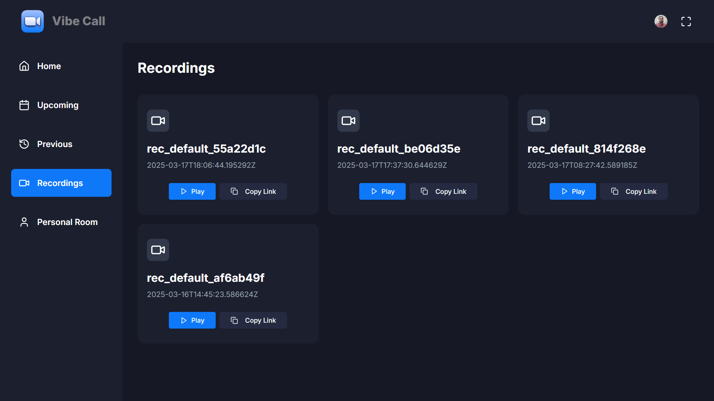

# VibeCall 🎥🚀

VibeCall is a full-stack video conferencing platform similar to **Google Meet & Zoom**, built with modern web technologies for a seamless and efficient user experience. 

---

---

🔗 **Live Demo:** [VibeCall](https://vibecalll.vercel.app/)  
👨‍💻 **Source Code:** [GitHub Repository](https://github.com/Coding1610/Next.js/tree/main/vibecall)  

---

## 🌟 Features

✅ **Instant Meetings** – Start a meeting with a single click and share the link with participants.  
✅ **Upcoming Meetings** – Schedule future meetings and invite people in advance.  
✅ **Meeting History** – View past meetings for reference.  
✅ **Screen or Video Recording** – Capture important discussions and watch them later.  
✅ **Secure Authentication** – Log in via **Email, Google, GitHub, LinkedIn** using Clerk.  
✅ **User Account Management** – Manage profiles securely with Clerk.  
✅ **Fully Responsive UI** – Works seamlessly on **mobile, tablet, and desktop**.  

---

## 🛠️ Tech Stack

### **Frontend**
- **Next.js** ⚡ – Fast & optimized React framework.
- **TypeScript** 🛠️ – Strongly typed for better reliability.
- **Tailwind CSS** 🎨 – Utility-first styling for rapid UI development.
- **Shadcn** 🖌️ – Prebuilt UI components with customization options.
- **ReactBits** ⚛️ – UI animations for a smooth experience.
- **ReactHaiku** 💫 – Elegant micro-interactions.

### **Backend & Real-time Features**
- **GetStream** 📞 – High-quality video/audio calling & real-time features.
- **Clerk** 🔐 – Secure authentication & user management.

---

Enjoy using **VibeCall**? Give it a ⭐ on GitHub! 🚀
